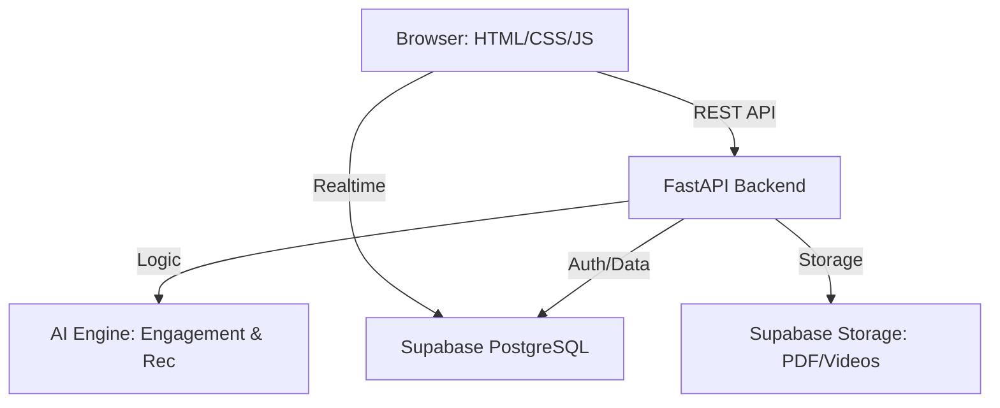

# PROJECT DOCUMENTATION: SYSTEM ARCHITECTURE
<!-- 
  File: docs/architecture.md
  Purpose: 
    This document provides a high-level technical blueprint of the 
    UENR E-Learning Platform. It explains how the Frontend, Backend, 
    Database (Supabase), and AI Engine interact to provide a 
    seamless learning experience.
-->

# UENR Interactive E-Learning Platform - System Architecture

## 1. Overview
The system is built using a modern full-stack architecture, separating the concerns of data storage, business logic, and user interface. It leverages AI to provide real-time feedback on student engagement and comprehension.

## 2. Component Diagram

## 3. Data Flow (Engagement Tracking)
1. **Student Viewer:** JS captures mouse/scroll/click events every second.
2. **Buffer:** Every 10 seconds, events are bundled and sent to `/api/engagement/log`.
3. **AI Analysis:** Backend passes metrics to the AI Engine.
4. **Scoring:** AI returns an Engagement Score (0-100).
5. **Persistence:** Raw metrics + Score are saved to the PostgreSQL database.
6. **Live Dashboard:** Supabase Realtime pushes the update to the Lecturer Dashboard.

## 4. AI Methodology
- **Engagement Analysis:** Uses a weighted heuristic model (normalized mouse frequency, click density, and scroll depth) with penalties for idle time.
- **Recommendations:** A rule-based engine that triggers specific resource types (Interactive Videos vs. Research Papers) based on the intersection of engagement scores and quiz performance.

## 5. Security Model
- **Authentication:** Managed by Supabase Auth (JWT).
- **Authorization:** Enforced via Row Level Security (RLS) at the database layer.
- **Isolation:** Students cannot access logs of other students; Lecturers are restricted to their assigned courses.
